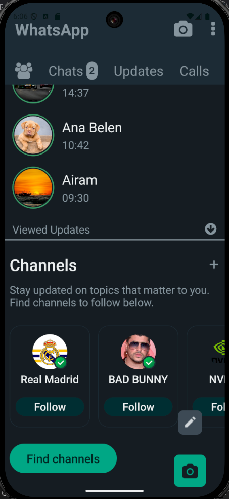

## 📚 Documentación del proyecto

A continuación se listan los apartados del proyecto con sus explicaciones detalladas:

- [Codigo de color: ](./docs/primera_parte.md)
- [Principios Atomic Desing: ](./docs/segunda_parte.md)
- [Implementacion de componente: ](./docs/tercera_parte.md)
- [Iconos implementados: ](./docs//cuarta_parte.md)

### Comparación de Apliaciones

## Captura de aplicacion a realizar

## Aplicacion realizada

