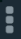
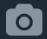

## 🧩 Iconos utilizados en el proyecto

|                          Icono                          | Nombre         | Librería     |
| :-----------------------------------------------------: | :------------- | :----------- |
|             | **Menu**       | Font Awesome |
|         | **Camera**     | Font Awesome |
|              | **Add**        | Font Awesome |
|     | **Arrow Down** | Font Awesome |
|  | **Verified**   | icons8       |

---

### 💡 Notas

- Todos los iconos se encuentran en la carpeta:  
  `assets/images/`

## Explicacion de la implementacion de un icono

## Icono de menu

```
<FontAwesome
  name="ellipsis-v"
  size={32}
  color={Color.textPrimaryColor}
/>
```

- Ubicado en la esquina superior derecha, representa el menu de configuracion de WhatsApp.
- Se implementa en el codigo mediante la etiqueta contenedora **`FontAwesome`** de la libreria **`@expo/vector-icons`** modificando la propiedad **`name`** para elegir uno de los iconos que quieras, **`size`** para modificar su tamaño y **`color`** para cambiar su color.

[<- Volver: ](../README.md)
