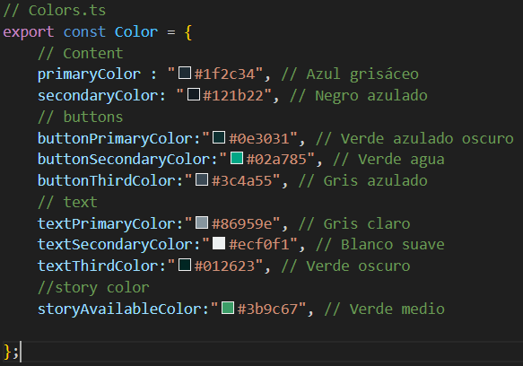

## 🎨 Obtención de los códigos de color

Para definir la paleta de colores de la aplicación, se utilizó la herramienta integrada de selección de color de Windows.
Esta herramienta permite obtener el código hexadecimal de cualquier color visible en la pantalla.

## 🧭 Activación de la herramienta

Para abrir el selector de color, se utiliza el siguiente atajo de teclado:

Ctrl + Windows + C

Al activarla, el sistema muestra un cursor que permite seleccionar un color en cualquier parte de la pantalla.
El color seleccionado se copia automáticamente en formato hexadecimal (#RRGGBB).

## 📁 Archivo de colores

Los colores obtenidos se almacenaron en una carpeta llamada styles en un archivo TypeScript llamado:

Colors.ts

Este archivo centraliza todos los valores de color utilizados en la aplicación, garantizando coherencia visual y facilitando la reutilización de estilos en los distintos componentes.

## 🧩 Ejemplo de contenido del archivo Colors.ts

