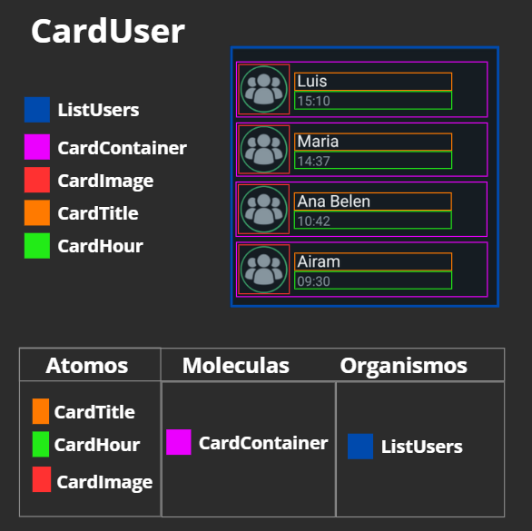

## 🏗️ Organización de los elementos visuales según Atomic Design

En la aplicación, se ha seguido el principio de **Atomic Design** para estructurar los componentes de manera modular, reutilizable y escalable.

---

## Átomos

Los átomos son los elementos más básicos, que no se pueden dividir más:

- `Text`, `Image`, `View` → componentes nativos de React Native usados en todos los elementos de la interfaz.
- `Color` → archivo centralizado de colores (`Colors.ts`) usado en toda la app.

### Ejemplo:

```tsx
<Text style={styles.textContainer}>{name}</Text>
<Image style={styles.imageUser} source={image} />
```

---

## Moléculas

Las moléculas combinan átomos para formar unidades funcionales pequeñas:

- **CardUser** → combina `Text` (nombre y hora) y `Image` (foto de usuario) dentro de contenedores `View`.
- Estas moléculas son reutilizables en listas o secciones de la app.

---

## Organismos

Los organismos son bloques completos de la interfaz, formados por varias moléculas:

- **UsersList** → contiene múltiples `CardUser` dentro de un `ScrollView`.
- **ViewedUpdate** → muestra actualizaciones vistas.
- **Channels** → contiene varios `CardChannel`.

---

## Templates / Pages

Los templates y páginas representan la **estructura global** de la pantalla:

- **BodyComponent** → organiza los organismos (`UsersList`, `ViewedUpdate`, `Channels`) en el cuerpo principal de la app.
- **App.tsx** → template principal que integra `HeaderComponent` + `BodyComponent` para conformar la pantalla completa.

---

## 🧩 Resumen en tabla

| Nivel           | Componentes ejemplo      |
| --------------- | ------------------------ |
| Átomo           | Text, Image, View, Color |
| Molécula        | CardUser                 |
| Organismo       | UsersList                |
| Template / Page | BodyComponent, App.tsx   |


