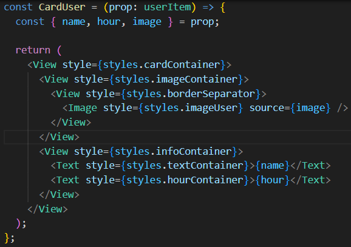
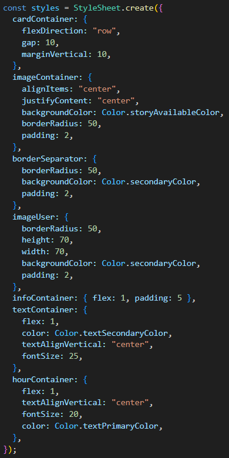

## 🧩 Componente: `CardUser`

El componente **`CardUser`** muestra la información de un usuario en una tarjeta visualmente organizada.  
Su estructura está dividida en dos partes principales:

- La **imagen** del usuario.
- La **información textual**.

---

## 🧱 Estructura general del componente

El componente está compuesto por un **view principal** que contiene toda la estructura de la tarjeta y unas propiedades que acepta por parametro en un objeto, que luego son destructuradas en variables separadas para su posterior uso dentro del componente.

Dentro de este se encuentran **dos contenedores principales**:

1. **Contenedor de imagen**
2. **Contenedor de texto**

---

### 🖼️ Contenedor de imagen

Dentro de este contenedor se organiza la parte visual del usuario:

- **`imageContainer`**: es el contenedor principal de la imagen.
- Dentro hay un **view separador**, que genera una línea oscura alrededor de la imagen.
- Finalmente, dentro de este separador se encuentra la **imagen del usuario** y es donde se coloca la propiedad **`image`** dentro de la propiedad del componente llamada **`source()`**.

---

### 📝 Contenedor de texto

Dentro de este contenedor se muestra la información del usuario:

- **`infoContainer`**: agrupa los textos informativos.
  - **`textContainer`**: contiene la etiqueta del **nombre del usuario** y es donde se coloca la propiedad **`name`**.
  - **`hourContainer`**: muestra la **hora** en la que el usuario colocó su estado y es donde se coloca la propiedad **`hour`**.

---

### 📋 Resumen jerárquico completo

---

## 🎨 Estilos

### 🧱 Estructura de estilos en `CardUser`

El componente está formado por una tarjeta que combina **imagen + texto**, todo dentro de un contenedor principal.

---

### 🟦 `cardContainer` (contenedor principal)

Coloca los elementos de manera **horizontal**, agrega una **separación entre ellos** y los **separa de arriba y abajo** de los otros componentes.

💡 Es el **marco principal** que define la forma horizontal de la tarjeta.

---

### 🟩 `imageContainer` (contenedor de la imagen)

Centra la imagen en un **círculo**, le agrega el **color verde** que indica que hay un estado, y separa un poco los elementos dentro de él para crear un espacio vacío.

💡 Este contenedor crea el **fondo circular** que envuelve la imagen del usuario.

---

### 🟨 `borderSeparator` (borde oscuro de la imagen)

Es **otro círculo** dentro del anterior, de **color oscuro** (igual al fondo) que genera un **espacio entre el color verde y la imagen** para crear ese efecto estilo estado de WhatsApp.

💡 Actúa como un **marco decorativo** para la foto.

---

### 🟧 `imageUser` (imagen del usuario)

Es la **imagen del usuario** con un tamaño definido (**70 × 70 px**) y tiene **forma circular**.

💡 Es la **foto final del usuario**, dentro de los círculos anteriores.

---

### 🟪 `infoContainer` (contenedor de texto)

Ocupa el **resto del espacio** junto a la imagen, y da **espacio interno** a los elementos de su interior.

💡 Este bloque corresponde al **lado derecho** de la tarjeta.

---

### 🟫 `textContainer` (nombre del usuario)

Es de **color blanco**, tiene **tamaño de 25 px** y está **centrado verticalmente**.

💡 Es el **texto principal** con el nombre del usuario.

---

### ⚪ `hourContainer` (hora del estado)

Es de un **tamaño más pequeño** que el nombre (**20 px**) y tiene el **mismo color**.

💡 Representa la **hora en la que se colocó el estado**, debajo del nombre.

### Estructura de los estilos

[<- Volver: ](../README.md)
